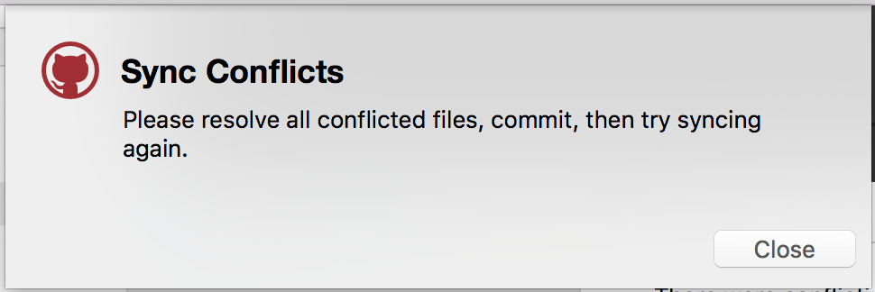
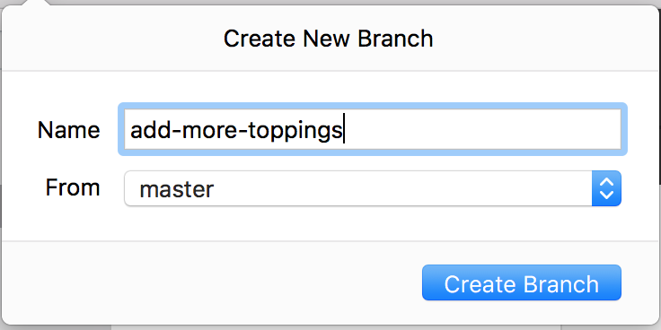
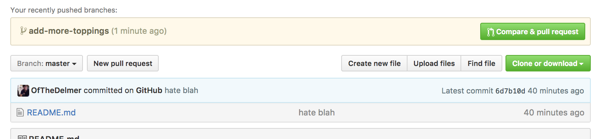

# Learn To code
## Git and GitHub

This is a fresh repository (repo) with only a README.  We'll be using it to accomplish the following.


| Objectives |
| :--- |
| Commit and track your versions of a project. |
| Fork and edit versions of a project. |
| Create a simple GitHub page. |


## Setup A GitHub Account

If you haven't already create a GitHub account.

## Editor

For any project you should have an editor. I recommend downloading and using [Atom](https://atom.io/). Why? It has good out the of the box hints for projects using Git and is popular.

* [Atom Tips](atom_tips.md)

## Terms Discussion

* Repo or repository
* Local repository
* Remote repository
* Git
* GitHub
* GitHub Desktop
* Terminal

## Download GitHub Desktop

You should begin downloading GitHub desktop.

* [Download Github Desktop](https://desktop.github.com/)
* Open GitHub Desktop and continue through it's setup process.
  * Connect to GitHub using your **Login** and **Password**.
  * Configure Git with your email.
  * Finish up and skip the tutorial.

----

## Downloading/Creating A Repo

Let's download our first project.

### Getting Organized

Before we download or create any project we should create a folder to help us remember where we have them all.

* Make a folder on your **Desktop** for all your future projects.
  * Call it `my_projects`

This will just help us stay organized.

### Downloading

Now that we have a place to put our projects we can download an existing one.

* Go to the [`pizza project`](https://github.com/nyc-learn-to-code/pizza) on GitHub.
*  Click the green `Clone or download` button in the upper right hand corner.
* **Select the Download ZIP**.
* Move the `pizza-master` folder from your `Downloads` to your `Desktop` folder called `my_projects`.

Remember moving the project from the `Downloads` to your `Desktop/my_projects` folder is just to help you stay organized.

### Opening In GitHub Desktop

* Open the `my_projects` folder and locate your `pizza-master` project.
* Drag the `pizza-master` project to your **GitHub Desktop** application.

You should be prompted to initialize a new project. This is because downloading the project does not retain any of the *Git* information. Effectively, this is a new project.

### Editing

You'll want to edit the `pizza-master/README.md` file to add your own list of favorite toppings.

You should drag the `pizza-master` folder to your editor to open it.

> You can also open atom add click `File > Open...` or on windows `File > Open Folder` and select your `Desktop/my_projects/pizza-master` folder.


Your `README` file should look like the following.

`README.md`

```markdown
# Learn To Code
## Love For Pizza

My favorite pizza toppings are...

```

You should edit it by adding your own favorite toppings like the following.

`README.md`

```markdown
# Learn To Code
## Love For Pizza

My favorite pizza toppings:

* Cheese
* More Cheese
* Even more cheese
```

Once you add your own favorite toppings you should save your changes.

### Committing

 This is a good stopping point to make your first commit.

* **Commit**: A commit stores the current contents of your project with message describing the changes. The message that goes along with a commit is called a **Commit Message**.

 > If you new files to commit in Atom then they will show up as green. It's a nice reminder.

Let's commit the file you edited. Fill out the **Summary** and **Description** of the changes then click **Commit to master**.

 

A Good commit message summary always starts with a **verb** describing the change in an imperative form:

* `Add a project readme`
* `Remove old comments in code`
* `Update project dependancies`
* `Fix search logic to include cute kittens`
* `Refactor legacy search logic`

Avoid other verb forms

* `Removing old comments`
* `Updated project dependancies`
* `More fixes to help searching for kittens`

Use your message description to explain **why** you are making the change. Briefly describe what changed also.

A good first commit can read as follows:

* Summary: Add project readme.
* Description: Adds a readme with a list of my favorite pizza toppings.

### Syncing to GitHub

Now we are ready to sync our changes to our own GitHub accounts.

* Click the `Publish` button in GitHub Desktop.


* Add a project name and description.


* Then click the publish repository button.


### View On GitHub

Now you should be able to view your first project on GitHub. If you go to GitHub and look under your repositories tab.

------

## Your Turn: Publishing

### Famous Places

* Open the GitHub Desktop application (if it's not open already).
* Click `File > New Repository` to create a new repository.
* Give it the name `famous-places`


* Make sure you choose 'Local Path' to be your `~/Desktop/my_projects` folder. This will help you remember where it is latter.

* Open your `famous-places` project in Atom or your editor of choice by dragging it from your `Desktop/my_projects` folder to your editor.

* Once it's open you can click create a new file by going to `File > New File` or hitting `CMD + N`.

* In the empty file write the following with your favorite places in the world.

```
# Famous Places

My favorite famous places in the world are the following:

* a place
* another place
* yet another place
```

* Then save the file by hitting `CMD + s` or clicking `File > Save` and saving the file as `README.md`.
* Go back to GitHub Desktop and review your changes.
* Write a commit summary and description and commit to master.
* Click publish.
* Give the project a name and description and publish.
* View the project on GitHub and verify it has your favorite changes.

### Repeat

Repeat the process for creating a project from scratch with a theme all your own.

--------

## Updating

Let's continue learning with our pizza project. We want to update our favorite toppings.

### Updating on GitHub

* Go to your `something-about-pizza` repo on GitHub.
* Click the `README.md` file.
* Click the pencil icon to edit the file. Change one of your favorite toppings.
* Then commit your changes a message summary and description.
* Go to GitHub Desktop and click `Sync`.
* You should now see the changes.

Here we are seeing we can make remote changes and sync them with our local repository.

### Pushing Local Changes

* Open your `pizza-master` project in Atom or your choice editor.
* Open the `README.md` and update your favorite toppings again.
* Commit the changes using your GitHub Desktop application with a summary and description.
* Then click sync.
* Go to GitHub and find your `something-about-pizza` project to verify the changes were synced.


### Merge Conflicts

If more than two people are collaborating on a project you can run into a conflict where two people have made changes that conflict.

Let's try to simulate how this can happen.


#### First: Make Remote Changes

* Go to GitHub and edit your `something-about-pizza` project `README.md` to say the following:

`README.md`

```
I love pizza.
```
* Commit those changes with a summary and description on GitHub's web editor.

**DO NOT SYNC THESE CHANGES**

### Second: Make Local Changes

* Go to your `README` locally for project and change it to the following.

`README`

```
I hate pizza.
```

* Then commit that change using the GitHub Desktop application with a summary and description.

### Trying to Sync:

When you click the sync button you'll get a conflict.



Close the warning and now you have to resolve the issue.

Your `README` should now look like the following:

`README`

```
<<<<<<< HEAD
I hate pizza.
=======
I love pizza.
>>>>>>> origin/master
```

This note that it tells us the first section before the `=====` belongs to your local `HEAD` of changes.

```
<<<<<<< HEAD
I hate pizza.
=======
```

Then comes the remote changes someone else synced.

```
=======
I love pizza.
>>>>>>> origin/master
```

It is now your job to determine how to resolve these changes. You should delete one of them or try to take some of the changes from the remote.

Let's imagine we somehow hate pizza. Then we should delete `origin/master` section. So our `README` just says the following:

`README`

```
<<<<<<< HEAD
I hate pizza.
======
```

But we should remove the extra `=====` and `<<<<` that were helping us see the conflicting lines.

`README`

```
I hate pizza.
```

### Resolving

Now that we edited the file with the conflict we can commit the resolution of the conflict.

* Go to the GitHub Desktop and create a commit summarizing the conflict resolution.

  * Resolve Merge Conflicts
  * Resolves README conflicts regarding feelings about pizza.


Once you have committed you should be able to sync your changes.

-----

## Your Turn: Make a change

* Change your `README` locally to say you love pizza. Commit the changes using GitHub Desktop and sync them to GitHub. Verify the changes were synced by going to GitHub.

-----

## Branching

Because working together can cause conflicts. Git has a built in branching mechanism that allows you to start making changes on in isolated history of changes called a branch.


Let's create a branch for some changes we want to make with our `something-about-pizza` project.

* Click `File > New Branch...`
* Then specify the name of the new branch.

  

Now are changes won't be on the `master` branch. The `master` branch is the main/default branch everyone is using as the current state of our project. Everything that goes on the project should be added through a review process using branches and GitHub to merge.

* Update your `README` to have one more new favorite pizza topping.
* Save that change and give it a commit summary and description.
* Then click the publish button.

You should now see an update on GitHub indicating the branch was added.



### Pull Request

Click the compare and pull request button. Then give the pull request a title and description.


You should always review your file changes before to spot errors. Create a commit and sync it.

If there aren't any errors click the `Create Pull Request` button. Once you have an open pull request someone can begin reviewing your changes and click the `merge pull request` button.

However, you are the only one working on this project, so just leave a comment like `LGTM` and click merge.

Once you have merged you'll be asked if you want to delete the branch. Click `delete branch` so you don't have a bunch of branches hanging around.

### Switching Local Branches

Now that you have merge your changes from the branch you created you can go ahead and switch back to master.

* Go to `Repository > Show Branches` and select the `master` branch.

However, you won't see the most recent changes so you will need to click the sync button to get them.

### Deleting A Branch

We've deleted our branch on GitHub for `add-more-toppings`. However, you also need to delete your local branch copy for `add-more-toppings` since we've already merged the changes it had.

* Go to `Repository > Show Branches` and select the `add-more-toppings` branch.
* Then go to `Branch > Delete add-more-toppings`


You should now be back sent back to your master branch.

------


## Your Turn

* Create a new branch called `add-more-cheese` from `master`.
* Create a new branch called `remove-toppings`from `master`.
* Delete the branch called `add-more-cheese`.
* Switch to the branch called `remove-toppings`. Update the `README` by removing a favorite topping. Commit the changes and publish the branch.

-----

## Forking

Forking is a way to create a copy of another repository for your personal use. You aren't allowed to edit another person's repository unless they've explicitly set you up as a contributor. Forking is the best you can do.

* Go to any repository on GitHub and click the fork button in the upper right hand corner.

  * Try forking the pizza repo: [pizza repo](https://github.com/nyc-learn-to-code/pizza).

* You should now see it under the list of repositories for you account.

## Cloning

Cloning is a way for you to copy a repo from GitHub with all the existing Git history. Unlike a download it will not be a fresh repo.

Let's clone your fork of the pizza app for this class:

* Go to GitHub Desktop
* Click `File  > Clone Repository` and type the `pizza`
* Select `Clone pizza`
* Give it a name and select your `Desktop/my_projects` folder

You have successfully cloned your first repo. 
